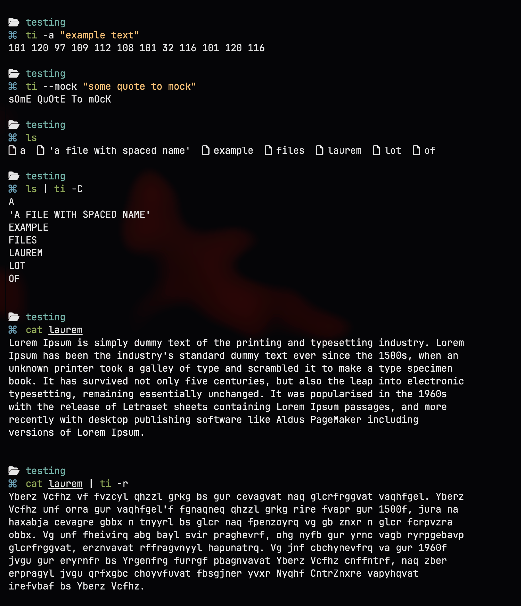

# text invert (ti)

Tool developed as part of a university assignment for the unit
[SWE40006](https://www.swinburne.edu.au/course/unit/s/swe40006/), Task 1."

Text Invert, or `ti` is a command line utility that allows to format text,
passed as both arguments and piped in, into one of various supported output.

### Supported Actions

### Example Usecase

